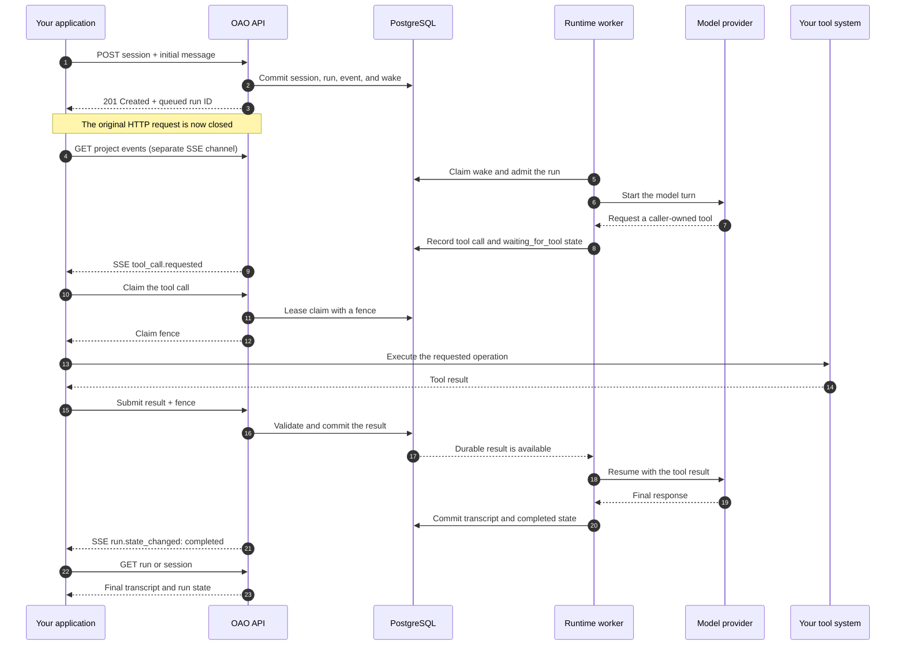

OAO separates the configuration you publish from the work that executes it.
That separation makes a running session reproducible and keeps an agent update
from changing work that is already in progress.

## Core objects

| Object               | Meaning                                                                              |
| -------------------- | ------------------------------------------------------------------------------------ |
| **Organization**     | Top-level tenant and audit boundary.                                                 |
| **Project**          | API-key, agent, session, and event-stream boundary inside an organization.           |
| **Agent definition** | Stable identity and display name for a managed agent.                                |
| **Model preset**     | Approved, stable, versioned key naming one reviewed model and routing policy.        |
| **Skill version**    | Immutable instructions and resources loaded progressively when relevant.             |
| **Agent version**    | Immutable snapshot of prompt, model, Skills, tools, sandbox policy, and limits.      |
| **Delegation**       | Durable coordinator-child relation with an exact child version and shared workspace. |
| **Session**          | Conversation bound to one agent version and its exact Skill versions.                |
| **Run**              | One user submission and its durable execution lifecycle.                             |
| **Tool call**        | Platform-owned work or a caller-owned request with a durable claim/result protocol.  |
| **Product event**    | Redacted, ordered fact used by the console and external real-time clients.           |
| **Workspace backup** | Latest verified S3-compatible archive used to replace a deleted thread sandbox.      |

## Request flow

The API does not keep the original request open for the whole run. A successful
create response means the work is durably queued. The caller opens a separate,
resumable SSE connection to observe progress. When the model requests a
caller-owned tool, OAO persists the request, changes the run to
`waiting_for_tool`, and emits `tool_call.requested`. The caller claims the work,
executes it, and submits the fenced result; the worker then resumes the model.
Platform-owned tools follow the same durable model/tool loop but execute inside
the runtime worker, so they do not require the caller to submit a result.

## PostgreSQL is the MVP authority

The MVP uses one PostgreSQL deployment for:

- Flue's canonical runtime persistence;
- tenant configuration and immutable agent and Skill versions;
- sessions, runs, messages, tool/approval ledgers, and audit entries;
- the short wake queue and fenced ownership records; and
- the append-only product event feed used for real-time UI updates.

`LISTEN/NOTIFY` may wake a reader sooner, but notifications are never the
correctness source. A reconnecting client resumes from a committed product-event
position.

At admission, OAO resolves only the exact Skill versions copied from the agent
version into the session. Flue initially shows the model their small name and
description catalog entries, then loads full instructions and individual
resources only when the model activates or reads them. See
[Versioned Skills](/concepts/skills).

A coordinator version can also pin a named roster of exact child-agent
versions. Delegation creates a separate child thread and Flue instance, binds it
to the coordinator's workspace, and returns an ID that can receive later
follow-up turns. See [Multi-agent orchestration](/concepts/multi-agent-orchestration).

## One active run per session thread

Only one run is admitted to Flue for a thread at a time. Later submissions stay
in OAO's PostgreSQL queue until the active run settles. This is an MVP safety
invariant: current Flue cancellation is conversation-wide, so serial admission
prevents cancelling one run from aborting a different run in the same session.

## Caller-owned tools

A caller-owned tool is a durable request, not a webhook that must succeed once.
An authorized integration claims the request for a lease, receives a monotonically
increasing fence, performs the work, and submits one immutable safe result. A
stale worker cannot commit with an older fence.

Before a successful caller result is persisted, OAO validates its value against
the output schema pinned in the run's immutable agent version. Invalid values
are converted into a redacted `invalid_tool_result` failure and handed back to
the model. The model retries retryable failures up to twice after the first
attempt; OAO enforces three total attempts and publishes every retry as a new
fenced tool call. Approval, cancellation, and exhausted-retry failures do not
loop.

Attach a small, deliberate set of supported files directly to a run. For a full
or changing codebase, caller-owned tools remain the recommended pattern: keep
the repository in your environment, expose narrow read/search tools, validate
paths against an allowlisted root, and return only the data the agent needs.

## Public versus private data

The console and client APIs are debugging surfaces. Authorized session reads
include provider thinking plus sandbox tool arguments/results so a user can
inspect the work behind a response. The transcript presents reasoning and tool
use as distinct, collapsed-by-default blocks, with separate colors in its
session overview. A linear ruler above the overview shows elapsed seconds from
the beginning of the transcript through its recorded end.
Provider credentials, authorization
headers, reasoning signatures, and SSE product-event payloads stay outside
these transcript fields.
Workspace archive contents also remain private object data; public diagnostics
contain only safe provider, key, size, and timing metadata.
