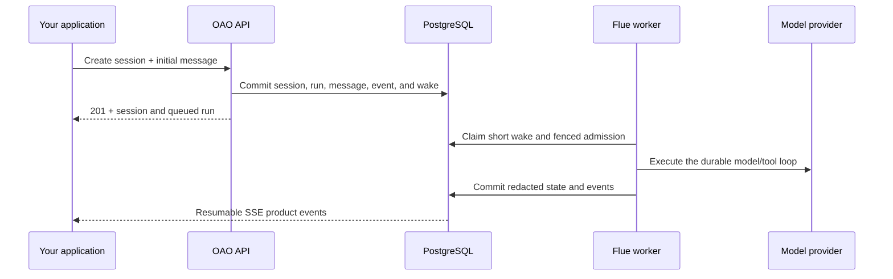

OAO separates the configuration you publish from the work that executes it.
That separation makes a running session reproducible and keeps an agent update
from changing work that is already in progress.

## Core objects

| Object               | Meaning                                                                             |
| -------------------- | ----------------------------------------------------------------------------------- |
| **Organization**     | Top-level tenant and audit boundary.                                                |
| **Project**          | API-key, agent, session, and event-stream boundary inside an organization.          |
| **Agent definition** | Stable identity and display name for a managed agent.                               |
| **Model preset**     | Approved, stable, versioned key naming one reviewed model and routing policy.       |
| **Agent version**    | Immutable snapshot of prompt, model preset, tools, sandbox policy, and limits.      |
| **Session**          | Conversation bound to one immutable agent version.                                  |
| **Run**              | One user submission and its durable execution lifecycle.                            |
| **Tool call**        | Platform-owned work or a caller-owned request with a durable claim/result protocol. |
| **Product event**    | Redacted, ordered fact used by the console and external real-time clients.          |
| **Workspace backup** | Latest verified S3-compatible archive used to replace a deleted thread sandbox.     |

## Request flow

The API does not keep the original request open for the whole run. A successful
create response means the work is durably queued. The worker admits it to Flue,
and clients observe progress through reads or SSE.

## PostgreSQL is the MVP authority

The MVP uses one PostgreSQL deployment for:

- Flue's canonical runtime persistence;
- tenant configuration and immutable agent versions;
- sessions, runs, messages, tool/approval ledgers, and audit entries;
- the short wake queue and fenced ownership records; and
- the append-only product event feed used for real-time UI updates.

`LISTEN/NOTIFY` may wake a reader sooner, but notifications are never the
correctness source. A reconnecting client resumes from a committed product-event
position.

## One active run per session thread

Only one run is admitted to Flue for a thread at a time. Later submissions stay
in OAO's PostgreSQL queue until the active run settles. This is an MVP safety
invariant: current Flue cancellation is conversation-wide, so serial admission
prevents cancelling one run from aborting a different run in the same session.

## Caller-owned tools

A caller-owned tool is a durable request, not a webhook that must succeed once.
An authorized integration claims the request for a lease, receives a monotonically
increasing fence, performs the work, and submits one immutable safe result. A
stale worker cannot commit with an older fence.

This is the recommended way to let an agent inspect files in a codebase: keep
the repository in your environment, expose narrow read/search tools, validate
paths against an allowlisted root, and return only the data the agent needs.

## Public versus private data

The console and client APIs are debugging surfaces. Authorized session reads
include provider thinking plus sandbox tool arguments/results so a user can
inspect the work behind a response. The transcript presents reasoning and tool
use as distinct, collapsed-by-default blocks, with separate colors in its
session overview. A linear ruler above the overview shows elapsed seconds from
the beginning of the transcript through its recorded end.
Provider credentials, authorization
headers, reasoning signatures, and SSE product-event payloads stay outside
these transcript fields.
Workspace archive contents also remain private object data; public diagnostics
contain only safe provider, key, size, and timing metadata.
