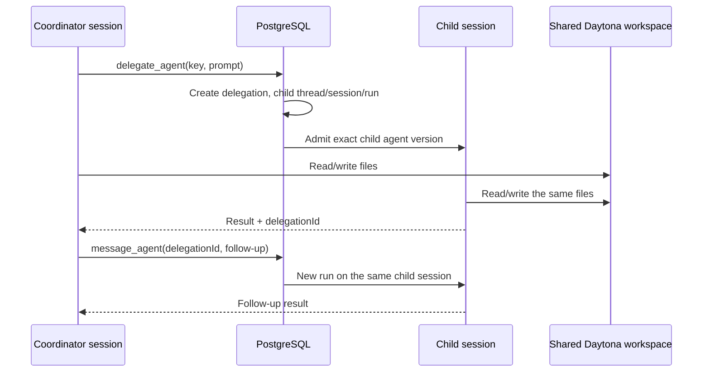

OAO coordinators can delegate work to named, versioned child agents. Each child
gets its own durable session and Flue instance, while every thread in the
delegation is bound to the coordinator's workspace. This gives the child access
to files created by the coordinator without mixing their conversation histories.

## Publish the roster first

A coordinator can call only delegates frozen into its immutable agent version:

```json
{
  "systemPrompt": "Coordinate shipment analysis and review extracted facts.",
  "modelPreset": "coordinator-v1",
  "tools": [],
  "skillVersionIds": [],
  "delegates": [
    {
      "key": "shipment-extraction",
      "description": "Extract shipment facts into the shared workspace.",
      "agentVersionId": "22222222-2222-4222-8222-222222222222",
      "maxParallel": 2
    }
  ],
  "sandbox": {
    "enabled": true,
    "provider": "daytona-primary",
    "network": "none",
    "capabilities": ["filesystem_read", "filesystem_write", "shell"]
  },
  "limits": { "maxTurns": 32, "timeoutMs": 300000 }
}
```

`agentVersionId` is an exact immutable child version, not a mutable agent alias.
Delegate keys and version IDs must be unique. A coordinator can contain at most
32 delegates, and `maxParallel` is from 1 through 8. Publishing rejects a child
version from the coordinator's own agent definition. The platform tool names
`delegate_agent` and `message_agent` are reserved.

Because the workspace is shared, coordinator and child versions must select
the same sandbox enabled state, provider key, snapshot, and network policy.
Their capability arrays may differ, so a child can receive a narrower set of
filesystem, shell, or browser tools. Publication also rejects direct or
indirect delegate cycles.

The console exposes the same roster under **Agents → Delegates**. Selecting an
agent records its latest version at publication time. A later child publication
does not change an existing coordinator version. Child versions with an
incompatible sandbox identity remain visible but disabled, with the mismatched
enabled state, provider, snapshot, or network policy explained beside them.

## Runtime flow



OAO, not Flue's ephemeral subagent helper, owns the durable relationship. The
runtime uses a separate registered `ManagedAgent` instance for each child
thread. PostgreSQL stores the coordinator-child relation, exact versions,
workspace binding, run sequence, idempotency hashes, and cancellation state.

The coordinator uses:

- `delegate_agent({ agent, prompt })` to create a persistent child thread;
- the returned `delegationId` to correlate later work; and
- `message_agent({ delegationId, prompt })` to create another run in that same
  child session after its previous run settles.

Different child versions can therefore carry different prompts, model presets,
Skills, tools, approvals, sandbox capability policies, and limits. The child is
still constrained by the shared sandbox's provider and network boundary; its
Flue conversation and transcript remain isolated.

## Durability and safety

- PostgreSQL is authoritative. Deterministic request keys make tool replay
  return the existing delegation or child run instead of duplicating work.
- Before a platform tool claim, the runtime idempotently provisions its
  tenant-scoped service principal. Internal broker or database failures become
  a generic platform-tool failure instead of exposing database details to the
  model or transcript.
- Child threads use the normal fenced admission, wake recovery, product-run
  deadline, and Flue retry paths.
- Cancelling or timing out a parent run cascades cancellation to its unsettled
  children. Operators can also cancel a delegation directly.
- Parallel calls are allowed up to the published `maxParallel` value. Each call
  has a separate child thread but shares the workspace.
- Raw delegation prompts are stored only as authorized child transcript/run
  input. Tool ledgers, product events, audit records, logs, and traces receive
  IDs and bounded metadata such as character counts, never the prompt text.
- RLS repeats organization and project identity across every orchestration
  relation. API reads and mutations require the delegation scopes documented in
  [HTTP API](/reference/http-api).

## Operator follow-up

`GET /sessions/{sessionId}` includes `delegations`. The console renders links to
the persistent child sessions. The Sessions table also places every visible
child immediately beneath its coordinator with an indented tree connector;
the child uses a compact row treatment, and both rows remain direct links to
their own isolated transcripts. Filtered or
paginated results never hide an otherwise visible child merely because its
parent is outside the current result set.

An operator can submit a later child turn with
`POST /delegations/{delegationId}/messages`, using a fresh idempotency key, or
cancel the relation with `POST /delegations/{delegationId}/cancel`.

<Warning>
  The MVP does not dynamically discover arbitrary agents, change a roster on a
  published version, move a child to a different workspace, or merge child
  conversation history into the coordinator. Human approval belongs to the
  normal durable tool/approval flow; only after settlement should the
  coordinator or operator send a follow-up to the same child.
</Warning>
